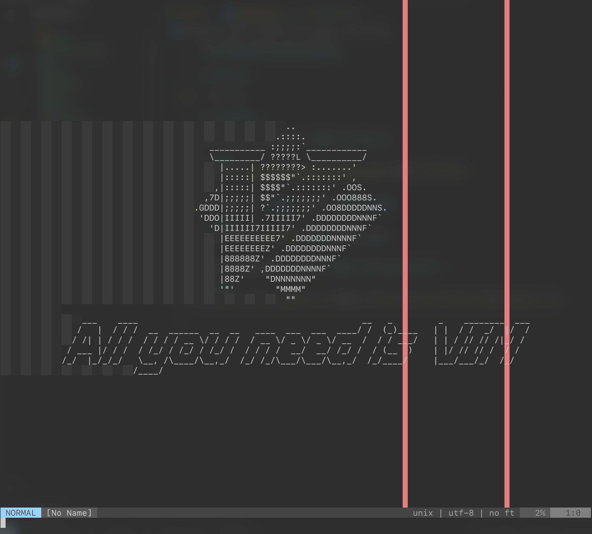
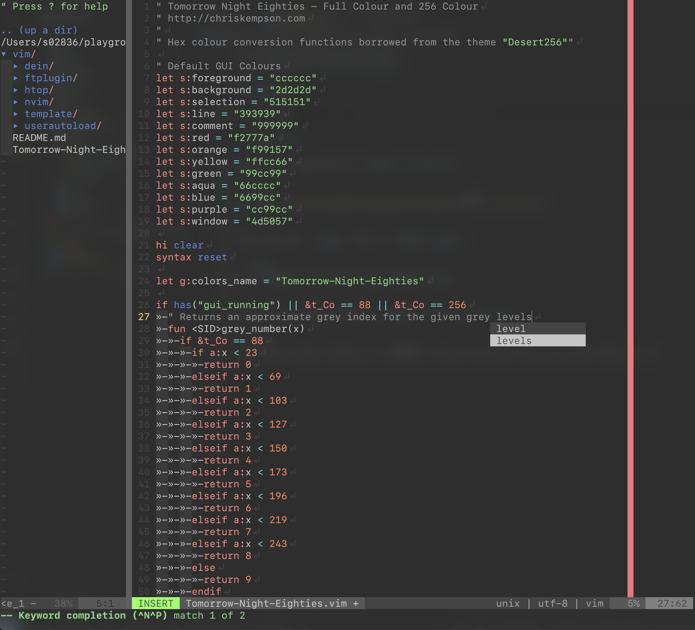

# [Peinan](https://github.com/peinan)'s Vim settings

<p align="center">
  
  
</p>

## Versions

- Vim: 8.0+

## Initialize

Clone this repository to `$HOME/.config/vim`.

```bash
git clone https://github.com/peinan/vim.git $HOME/.config/vim
```

Then link the `.vimrc` file to `$HOME/.vimrc`.

```bash
ln -s $HOME/.config/vim/.vimrc $HOME/.vimrc
```

Copy the colorscheme file to `$HOME/.config/vim/colors`.

```bash
cp Tomorrow-Night-Eighties.vim $HOME/.config/vim/colors/Tomorrow-Night-Eighties.vim
```
